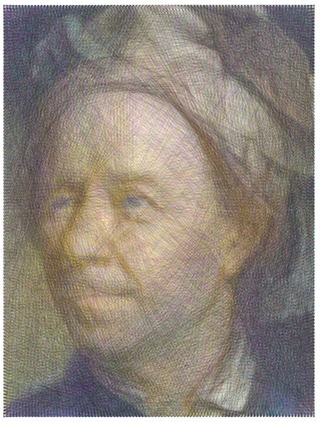
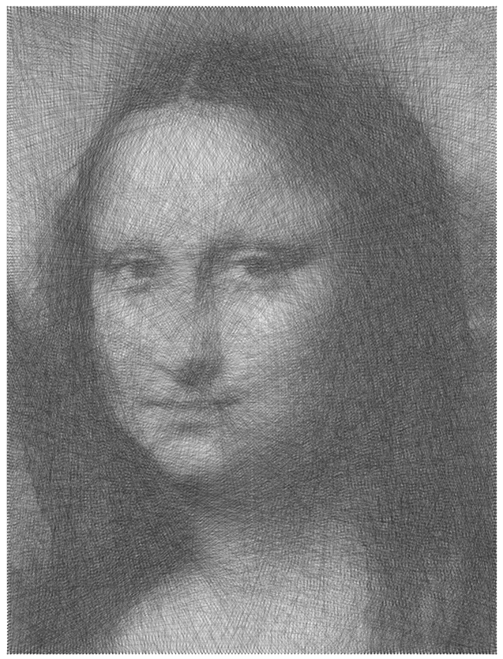

# StringArt

This project converts images into string art by arranging nails in a pattern on a canvas and guiding a single thread to create the artwork. The project includes four scripts, each designed to process images with different canvas shapes and color formats:

- **Black & White with Circular Canvas**
- **Black & White with Rectangular Canvas**
- **Color with Circular Canvas**
- **Color with Rectangular Canvas**

## How It Works

The code generates a `.txt` file that contains a list of nails the string should go around in a specific order. The order of the nails defines the pattern of the string art.

## Files

- `Circular_String_Art_BlackWhite_Nail_List.m`: Converts an image into a black & white String Artwork on a circular canvas.
- `Circular_String_Art_Color_Nail_List.m`: Converts an image into a black & white String Artwork on a rectangular canvas.
- `Rectangular_String_Art_BW_Nail_List.m`: Converts an image into a colored String Artwork on a circular canvas.
- `Rectangular_String_Art_Color_Nail_List.m`: Converts an image into a colored String Artwork on a rectngular canvas.

## Instructions for use

Each MATLAB script works independently and does not require other files. Follow these steps to use the scripts:

1. Save the desired `.m` script in a folder.
2. Save your input image in the same folder.
3. In the script, enter the name of your image in the `filename` variable under **User Inputs**.
4. Enter the number of nails in the `nails` variable under **User Inputs**.
5. (Optional) Edit the **Advanced User Inputs** section to adjust settings as needed.
6. Click **Run** to execute the script.
7. The script will generate a `.txt` file(s) containing the sequence of nails for the string art pattern.

## Example Images

Below are examples of the String Art produced:

